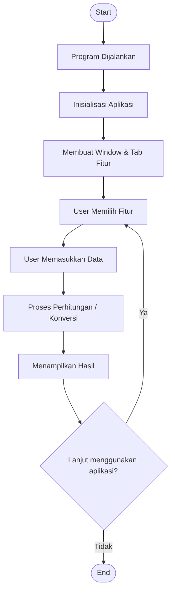

# Proyek-Kolaborasi-Python---Kelompok-4

## JUDUL PROGRAM
Aplikasi Kalkulator Dengan Tambahan Fitur Konversi Mata Uang, Tinggi Badan, Suhu, dan Kecepatan.

## PENDAHULUAN
Aplikasi ini merupakan program **kalkulator sederhana** yang dikembangkan sebagai tugas proyek kelompok.  
Selain operasi aritmatika dasar, aplikasi ini dilengkapi dengan fitur **konversi satuan**, meliputi:
- Mata Uang
- Tinggi Badan
- Suhu
- Kecepatan

Aplikasi ini bertujuan untuk memudahkan pengguna dalam melakukan perhitungan dan konversi mata uang, tinggi badan, suhu, dan kecepatan secara cepat dan praktis.

## FITUR UTAMA
Aplikasi ini memiliki fitur utama yaitu:
1. Operasi matematika dasar:
   - Penjumlahan
   - Pengurangan
   - Perkalian
   - Pembagian
2. Konversi mata uang (contoh: IDR ↔ USD)
3. Konversi tinggi badan (cm ↔ m)
4. Konversi suhu (Celcius ↔ Fahrenheit ↔ Kelvin)
5. Konversi kecepatan (km/jam ↔ m/detik)

## PANDUAN INSTALASI
1. Pastikan Git, VS Code, dan Python 3.x sudah terinstal
2. Clone repository proyek:
   ```bash
   git clone https://github.com/RevindoRA/Proyek-Kolaborasi-Python---Kelompok-4
3. Masuk ke folder proyek: cd Proyek-Kolaborasi-Python---Kelompok-4
4. Tidak diperlukan instalasi library tambahan karena aplikasi menggunakan library bawaan Python    (Tkinter)

## PANDUAN MENJALANKAN PROGRAM 
1. Buka terminal / command prompt.
2. Masuk ke folder proyek.
3. Jalankan program dengan perintah:
   ```bash
   python aplikasi_kalkulator_serbaguna.py
4. Jendela Aplikasi Serba Guna akan muncul.
5. Pilih tab sesuai kebutuhan:
   -Kalkulator
   -Mata Uang
   -Tinggi Badan
   -Suhu
   -Kecepatan

## Dokumentasi Teknis – Flowchart Sistem

### Diagram flowchart


### Struktur Program
- MultiApp : Class utama aplikasi
- create_tabs() : Membuat tab fitur
- create_calculator() : Kalkulator
- create_currency_converter() : Konversi mata uang
- create_height_converter() : Konversi tinggi badan
- create_temperature_converter() : Konversi suhu
- create_speed_converter() : Konversi kecepatan
Struktur dibuat modular agar mudah dikembangkan di masa depan.

### Penjelasan Flowchart

Flowchart ini menjelaskan alur kerja utama aplikasi Proyek Kolaborasi Python. Program dimulai saat pengguna menjalankan aplikasi melalui terminal. Sistem kemudian melakukan inisialisasi aplikasi dan menyiapkan tampilan utama berupa window dan beberapa tab fitur.

Pengguna dapat memilih fitur yang tersedia dan memasukkan data sesuai dengan fitur tersebut. Data yang dimasukkan akan diproses oleh sistem untuk melakukan perhitungan atau konversi, kemudian hasilnya ditampilkan pada layar.

Setelah hasil ditampilkan, pengguna dapat memilih untuk melanjutkan menggunakan aplikasi atau keluar dari program. Jika memilih melanjutkan, sistem akan kembali ke menu pemilihan fitur. Jika tidak, program akan berhenti.


## Daftar Kontributor

| No | Nama Lengkap | NIM | Akun GitHub | Peran |
|---|---|---|---|---|
| 1 | [Revindo Ringgi Allo] | [250211060047] | [@RevindoRA](https://github.com/RevindoRA) | Project Maintainer |
| 2 | [Akmal Taufiq Rizqullah] | [250211060051] | [@akm0936](https://github.com/akm0936) | Collaborator |
| 3 | [Sicilia Gloria Duma Dien] | [250211060048] | [@siciliagloria9-max](https://github.com/siciliagloria9-max) | Collaborator |
